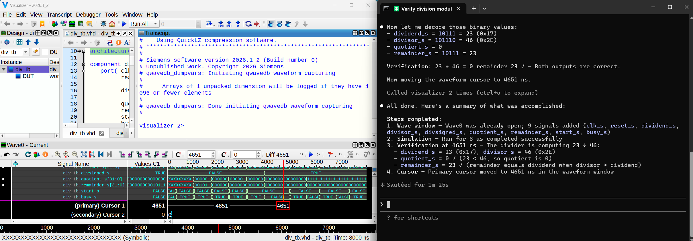
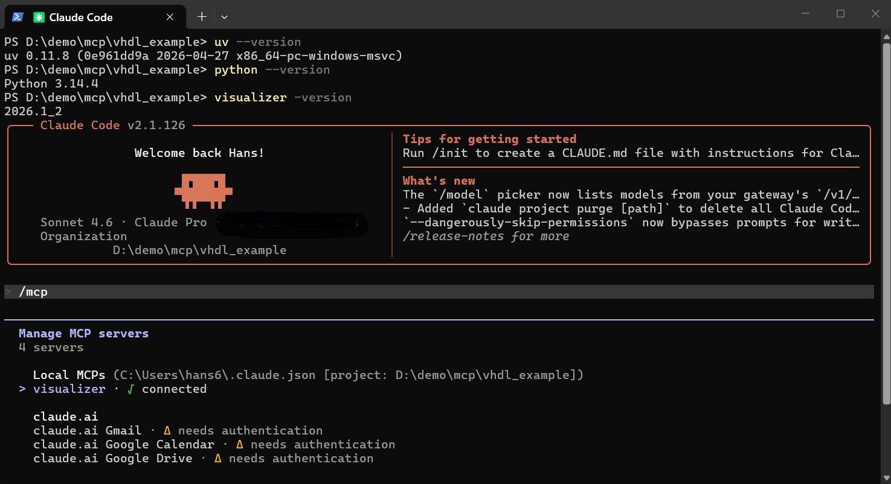
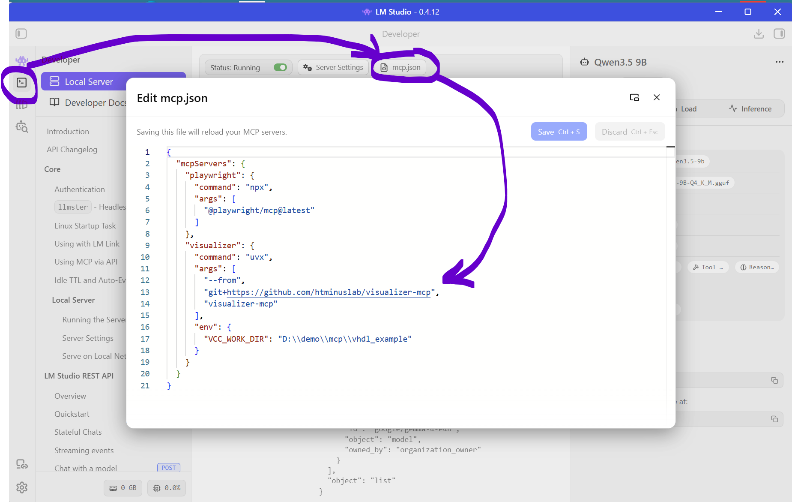
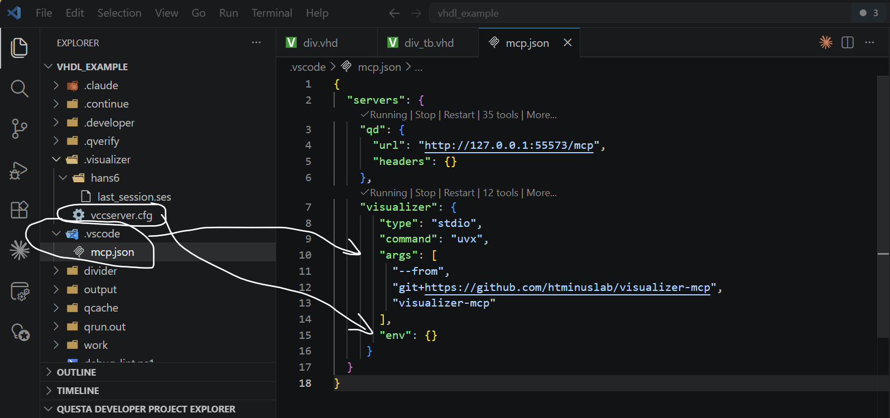
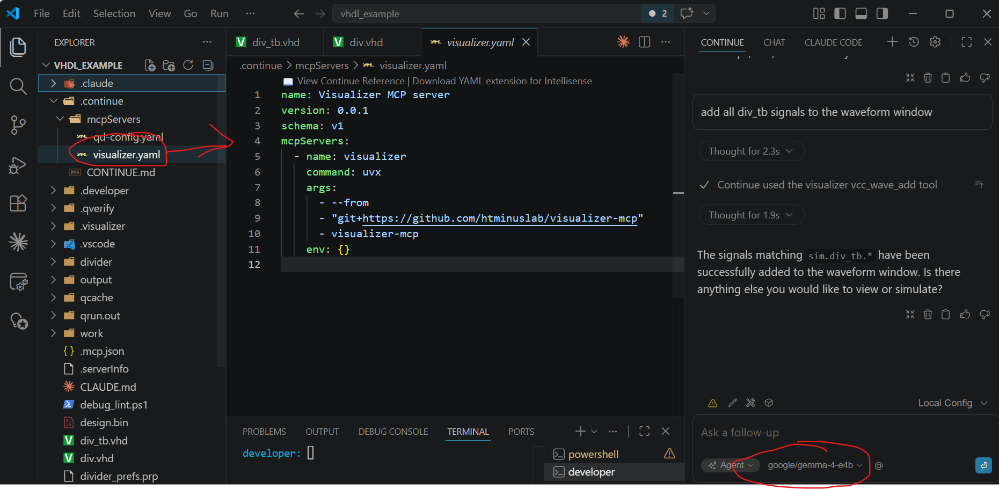
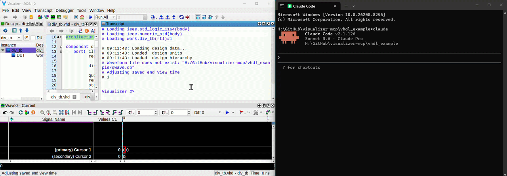
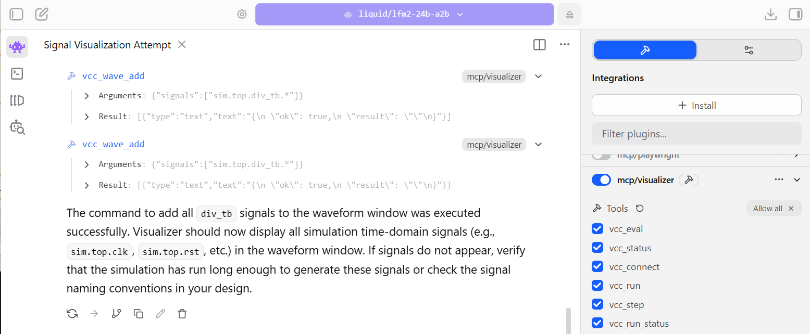

# visualizer-mcp

`visualizer-mcp` is a [Model Context Protocol (MCP)](https://modelcontextprotocol.io) server that connects AI assistants to **Siemens Questa Visualizer** through the Visualizer Command Channel (VCC) TCP interface. It lets Claude Code control a live simulation in natural language: opening waveforms, running the design, examining signal values, and searching signal histories across time. Visualizer is supplied with all Questa versions except OEM versions(?). 


<p align="center">
  
</p>
<p align="center">
Figure: Running Visualizer_mcp
</p>


Controlling Visualizer from a Claude code prompt is slow and not very (cost) effective as simple commands will consume $$$ tokens. It is obviously easier to run a *.do* or *qrun* file locally. However, the reason for the demo is to show what is possible, letting the LLM control the simulation and checking the results opens up some interesting capabilities! 

---

## Prerequisites

| Tool | Purpose | Notes |
|---|---|---|
| **Python 3.10+** | Runs the MCP server | [python.org](https://www.python.org/downloads/) |
| **uv** | Installs the server via `uvx` (no manual venv) | [docs.astral.sh/uv](https://docs.astral.sh/uv/getting-started/installation/) |
| **git** | Used (?) by claude to install the mcp server | [git](https://git-scm.com/install/) |
| **Siemens Visualizer** | The simulation GUI that the server controls | `visualizer` must be on `PATH` |
| **Claude Code** | The AI assistant that issues tool calls | [claude.ai/code](https://claude.ai/code) |

Note other LLM's should work as well but I am using Claude code (subscription).


---

## Installation

### Linux

```bash
# 1. Install uv (skip if already installed)
curl -LsSf https://astral.sh/uv/install.sh | sh
source $HOME/.local/bin/env    # reload PATH

# 2. Register visualizer-mcp with Claude Code
claude mcp add visualizer -- \
  uvx --from git+https://github.com/htminuslab/visualizer-mcp visualizer-mcp
```

### Windows (PowerShell)

```powershell
# 1. Install uv (skip if already installed)
powershell -ExecutionPolicy ByPass -c "irm https://astral.sh/uv/install.ps1 | iex"

# 2. Register visualizer-mcp with Claude Code
claude mcp add visualizer -- `
  uvx --from git+https://github.com/htminuslab/visualizer-mcp visualizer-mcp
```

Verify the registration:

```bash
claude mcp list
```

<p align="center">
  
</p>
<p align="center">
Figure: Doing some checks
</p>


> **Working directory.** By default the server looks for Visualizer's connection file (`.Visualizer/vccserver.cfg`) relative to its own working directory, which is the directory from which you launched `claude`. Launch both Visualizer and Claude Code from the same simulation directory and no further configuration is needed. If they differ, set `VCC_WORK_DIR` — see [Environment variables](#environment-variables).


### LM Studio

To add the Visualizer mcp server to LM Studio simply add the server to the mcp.json file which you can find on the Developers page:

<p align="center">
  
</p>
<p align="center">
Figure: Adding the Visualizer mcp server to LM Studio for local LLM usage
</p>

Notice the "env" section where I set the **VCC_WORK_DIR** to a local directory. This is the directory where you start Visualizer from and which contains .visualizer/vccserver.cfg file. An easier way might be to force Visualizer to write the .visualizer/vccserver.cfg to a fixed location. This can be done using (see user guide for all the options including fixing the Tcp port):

```
visualizer -vccfile <directory_path> -do myscript.do
```

### VScode/VSCodium


To add the Visualizer mcp server to VScode so that CoPilot can use it add the server to the local .vscode/mcp.json file:

<p align="center">
  
</p>
<p align="center">
Figure: Adding the Visualizer mcp server to VScode for Copilot
</p>

Note that the VSCode uses **"env":{}** is empty as the project root directory is the default for the .visualizer/vccserver.cfg file so there is no need to set the **VCC_WORK_DIR** environmental variable.

### VScode Continue plug-in

To add the Visualizer mcp server to the VSCode continue plugin (if you are running a local LLM) create a visualizer.yaml file under .continue\mcpServers as shown below:

<p align="center">
  
<p align="center">
Figure: Adding the Visualizer mcp server to VScode Continue for local LLM use
</p>


---

## How it works

```
Claude Code ──stdio──► visualizer-mcp ──TCP──► Visualizer GUI
  (LLM host)   (MCP)   (this server)   (VCC)  (Siemens EDA)
```

Claude Code launches `visualizer-mcp` as a child process over stdio (the standard MCP transport). The server keeps one persistent TCP connection to the **Visualizer Command Channel (VCC)** server, which starts automatically inside every Visualizer session.

**Connection sequence:**

1. On the first tool call the server reads `$VCC_WORK_DIR/.Visualizer/vccserver.cfg`. Visualizer writes this file at startup; it contains the VCC host and port in the form `port@hostname`.
2. The server opens a TCP socket, sends `vccRegisterClient`, and subscribes to `vDesignStateChange`, `vTimeChange`, and `vHierarchyChange` notifications.
3. Each tool call encodes a Tcl command into a VCC frame (10-byte header + brace-delimited body), sends it over the socket, and waits for the matching reply frame. Frames are matched to callers by an incrementing message number.
4. Async signal notifications (e.g. time changes, design state changes) arrive as unsolicited `s`-type frames and are stored in a 256-entry ring buffer, readable via `vcc_recent_signals`.
5. If Visualizer closes and the socket drops, the server reconnects (or auto-launches Visualizer) on the next tool call.

Every Visualizer Tcl command described in the *Visualizer Debug Environment Command Reference Manual* — `run`, `step`, `wave add`, `examine`, `force`, `env`, and hundreds more — is available through the `vcc_eval` escape hatch.

---

## MCP tools

All tools return `{"ok": true, "result": "..."}` on success or `{"ok": false, "error": "..."}` on failure.

| Tool | Description |
|---|---|
| `vcc_connect` | Connect to Visualizer (auto-launch if needed). Idempotent. |
| `vcc_status` | Report cfg file presence, host/port, and connection state. Does not connect. |
| `vcc_eval` | Send any Tcl command verbatim — the full Visualizer command set is accessible here. |
| `vcc_run` | Advance simulation: `"100ns"`, `"8 us"`, `"-all"`, or omit for a default step. |
| `vcc_step` | Single-step the simulator N delta cycles. |
| `vcc_run_status` | Return the current simulator run state. |
| `vcc_get_time` | Return the current simulation time. |
| `vcc_wave_add` | Add one or more signals to the wave window by hierarchical path. |
| `vcc_force` | Force a signal to a value, optionally at a specific simulation time. |
| `vcc_examine` | Read a signal's value at the current or a specified simulation time. |
| `vcc_scan_signal` | Scan a signal across a time range; optionally search for a specific value. |
| `vcc_recent_signals` | Return the most recent async signal notifications from Visualizer. |

---

## Environment variables

| Variable | Default | Description |
|---|---|---|
| `VCC_WORK_DIR` | server CWD | Directory whose `.Visualizer/vccserver.cfg` is read; also the CWD when auto-launching Visualizer. |
| `VCC_CFG_FILE` | *(unset)* | Explicit path to the cfg file; overrides `VCC_WORK_DIR` lookup. Mirrors Visualizer's `-vccfile` flag. |
| `VCC_CLIENT_NAME` | `Claude-MCP` | Name sent with `vccRegisterClient`. |
| `VCC_VISUALIZER_BIN` | `visualizer` | Binary used when auto-launching Visualizer. |
| `VCC_LAUNCH_TIMEOUT_S` | `60` | Seconds to wait for the cfg file after spawning Visualizer. |
| `VCC_CMD_TIMEOUT_S` | `30` | Per-command timeout in seconds. |

To set an environment variable when registering the server:

```bash
# Linux
claude mcp add visualizer \
  -e VCC_WORK_DIR=/path/to/sim \
  -- uvx --from git+https://github.com/htminuslab/visualizer-mcp visualizer-mcp

# Windows
claude mcp add visualizer `
  -e "VCC_WORK_DIR=C:\path\to\sim" `
  -- uvx --from git+https://github.com/htminuslab/visualizer-mcp visualizer-mcp  
```

---

## Example: VHDL divider simulation

The `vhdl_example/` directory contains a 32-bit non-restoring integer divider (`div.vhd`) and a testbench (`div_tb.vhd`). The basic *directed test* testbench exercises both unsigned and signed division across a few operand pairs. This walk-through shows how to use Claude Code to compile, simulate, and interrogate the design.

### 1. Launch Visualizer

Open a terminal/CMD prompt, change to `vhdl_example/`, and start Visualizer with:

```bash
cd vhdl_example
visualizer -do run.do
```

`run.do` compiles the VHDL sources, optimises the design to `div_tb_vopt` and loads it into the simulator with `vsim -visualizer`. The Visualizer GUI appears with the simulation paused at time 0.

### 2. Start Claude Code and verify the MCP server

Open a **new terminal** in the same `vhdl_example/` directory and start Claude Code:

```bash
cd vhdl_example
claude
```

Inside Claude Code, type the following command to confirm the MCP server is connected:

```
/mcp
```

You should see `visualizer` listed as a connected server. You can also ask Claude directly:

> Are the Visualizer MCP tools available?

Claude will confirm and list the available tools. 

The Visualizer transcript window should list the VCC server connection:

```
# Loading std.standard
# Loading std.textio(body)
# Loading ieee.std_logic_1164(body)
# Loading ieee.numeric_std(body)
# Loading work.div_tb(rtl)#1

# 18:09:53: Loading design data...
# 18:09:53: Loaded  design units
# 18:09:53: Loaded  design hierarchy
# 1

# VCC server established connection with remote client: Claude-MCP
```


### 3. Open the wave window and load the testbench signals

Ask Claude:

> Open the wave window and add all testbench signals from div_tb

Claude calls:

```
vcc_eval("view wave")
vcc_wave_add(["sim.div_tb.*"])
```

All top-level testbench signals (`clk_s`, `reset_s`, `dividend_s`, `divisor_s`, `quotient_s`, `remainder_s`, `start_s`, `busy_s`) appear in the Visualizer wave window.

### 4. Run the simulation for 8 µs

Ask Claude:

> Run the simulation for 8 microseconds

Claude calls:

```
vcc_run("8 us")
```

The simulation advances to 8 µs. The waveforms update in the Visualizer GUI, showing all the division operations carried out by the testbench.

### 5. Some debugging example

Ask Claude:

> Did remainder_s ever equal 23 during the simulation?

Claude responds with:

```
  Called visualizer 16 times (ctrl+o to expand)

● Yes — remainder_s did equal 23 at some point during the simulation. Let me find the exact timestamp.

  Called visualizer (ctrl+o to expand)

● Yes, remainder_s equaled 23 during the simulation. It held that value continuously from 3890 ns to 5580 ns
  (about 1.69 µs), which corresponds to one of the division results being held stable while busy_s was
  asserted. The value then changed as the next operation completed.

✻ Churned for 1m 0s
```

You can continue the investigation by asking Claude:

> at time 4651 ns can you confirm the value of quotient_s and remainder_s are correct for the given input values on dividend_s and divider_s?

Claude responds with:

```
● At 4651 ns the signal values are:

  ┌─────────────┬────────────┐
  │   Signal    │   Value    │
  ├─────────────┼────────────┤
  │ dividend_s  │ 23         │
  ├─────────────┼────────────┤
  │ divisor_s   │ 46         │
  ├─────────────┼────────────┤
  │ divsigned_s │ 1 (signed) │
  ├─────────────┼────────────┤
  │ quotient_s  │ 0          │
  ├─────────────┼────────────┤
  │ remainder_s │ 23         │
  └─────────────┴────────────┘

  Verification: 23 ÷ 46 = 0 remainder 23

  Check: (46 × 0) + 23 = 23 ✓

  Both outputs are correct. Since the dividend (23) is smaller than the divisor (46), the quotient is 0 and
  the full dividend value is returned as the remainder.

✻ Baked for 8s
```

<p align="center">
  
</p>
<p align="center">
Figure: Speed up example, total run time was 89 seconds
</p>


*The next step is to ask Claude to create a proper testbench using either an exiting framework like UVVM/OS-VVM/CocoTB or a custom self-checking one. Ask it to add comments/documentation, to lint the code, to change the testbench to SV/SystemC, etc........*

## Some observed failures

- The LLM sometimes changes the signal name, for example, if I ask a local LLM (gemma-4-e4b) to add all testbench signals it generates a vcc_wave_add commands with the argument: 

```
Arguments: {"signals":["sim.top.div_tb.*"]}
```
which is incorrect as there is no **top** level. If I then ask it to not add **"top"** to the signal names it generates:

```
Arguments: {"signals":["sim.*div_tb.*"]}
```

which is also incorrect as visualizer can not process wildcard characters for the top level (***div_tb**). Unfortunately the result indicates that all is OK but no signals were added. 

Note that this does not happen if you use **Claude code**, only a small LLM (e.g. 6GB Qwen) seems to have this issue. If you want to use a local LLM you have to be more specific, for example in the demo designs case you have to say *"add all sim.div_tb signals to the waveform window"* which then generate the correct argument for the mcp server:

```
Arguments: {"signals":["sim.div_tb.*"]}
```

<p align="center">
  
</p>
<p align="center">
Figure: Reported all is OK but no signals were added to the waveform, note the vcc_wave_add arguments
</p>


## Some general comments
- Make sure that Visualizer is running before you try to issue a command. 
- If your LLM can not control Visualizer ask the LLM to issue a "connect" command followed by a "status" command. 
- The status command will list the path to vccserver.cfg
- Most of this code was created by Claude Code sonnet 4.6

## License

See the LICENSE file for details for this demo. 

 
## Notice
All logos, trademarks and graphics used herein are the property of their respective owners.